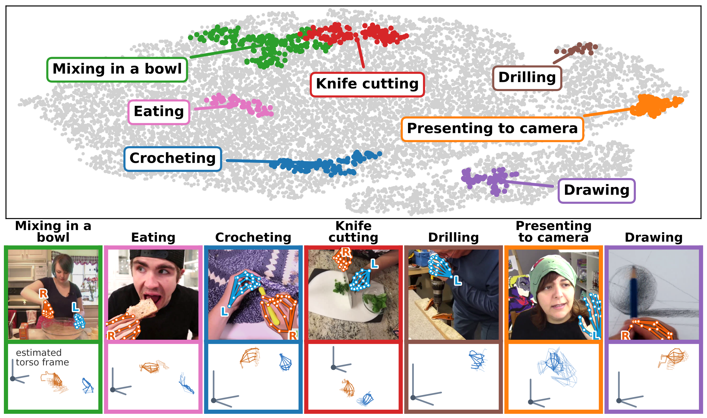

# RoboTok

**An Internet-Scale Data Engine for Human Demonstration Video Retrieval and
Dexterous Manipulation Learning**

Howard Qian¹, Yiting Chen¹, Yunfei Xie¹, Kejia Ren¹, Podshara Chanrungmaneekul¹,
Gaotian Wang¹, Bowen Wen², Chen Wei¹, Kaiyu Hang¹

¹ Rice University  ·  ² NVIDIA

Retrieves web video clips by 3D hand-motion similarity embedding space, plus a
VN model that estimates a body/torso frame from two-hand trajectories.



## Install

```bash
pip install -r requirements.txt
```

Use `faiss-gpu` instead of `faiss-cpu` on CUDA machines. The DTW kernels are
numba CUDA kernels and need a GPU.

## Usage

```bash
cd retrieval_training
python train.py --config configs/default.yaml   # trains; auto-builds artifacts
python -m pytest tests/ -q                      # tests
```

Config paths are relative to the repo root; `ABMR_PROJECT_ROOT` overrides it.
The held-out split is a seeded random **clip-level** split, not per-video — see
`config.py` for the same-video caveat, and `dtw_cknna.run_per_video_split_cknna`
for cross-video-only CKNNA.

## Data

- **MANO / SMPL-H** models are not redistributable. Register at
  https://mano.is.tue.mpg.de, then place `MANO_LEFT.pkl`, `MANO_RIGHT.pkl` and
  the Extended SMPL+H neutral `model.npz` in
  `retrieval_training/torso_estimation_training/neutral/`.
- **Retargeting code** (VN alignment, robot models, IK) lives in
  [EgoInfinity](https://github.com/Rice-RobotPI-Lab/EgoInfinity); point
  `RETARGET_DIR` at `<checkout>/retarget`. The depth-grounding code in
  `build_dataset/0depth_ground_keypoints.py` is adapted from that repository.
- `build_dataset/` and some visualizers read a private clip database (the `db`
  module, not included). Training, eval and tests run from exported `.pt`
  artifacts. `eval_data/torso_relative_clip_keypoints.pt` is multi-GB and not
  included.

## Citation

```bibtex
@article{qian2026robotok,
  title     = {RoboTok: An Internet-Scale Data Engine for Human Demonstration
               Video Retrieval and Dexterous Manipulation Learning},
  author    = {Qian, Howard and Chen, Yiting and Xie, Yunfei and
               Ren, Kejia and Chanrungmaneekul, Podshara and Wang, Gaotian and
               Wen, Bowen and Wei, Chen and Hang, Kaiyu},
  journal   = {arXiv preprint arXiv:TODO},
  year      = {2026}
}
```

## License

MIT ([LICENSE](LICENSE)). MANO / SMPL-H are **not** covered and remain under
their own MPI-IS terms.
